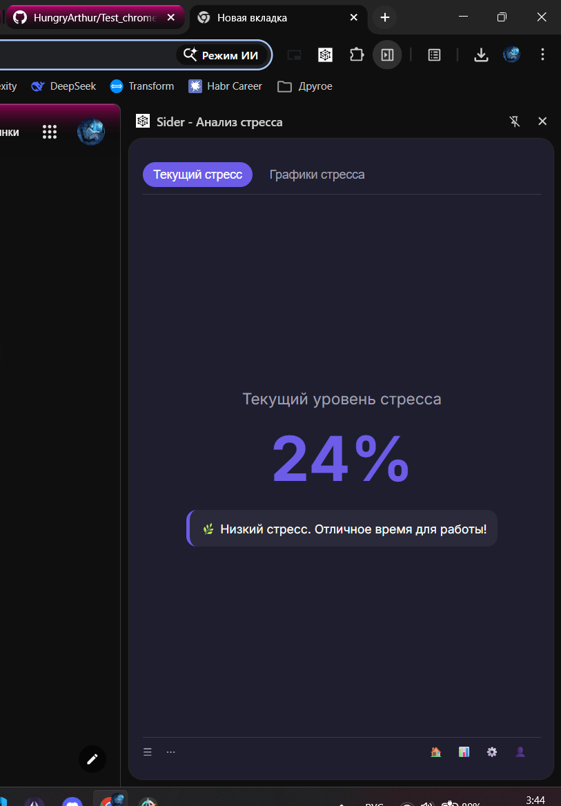
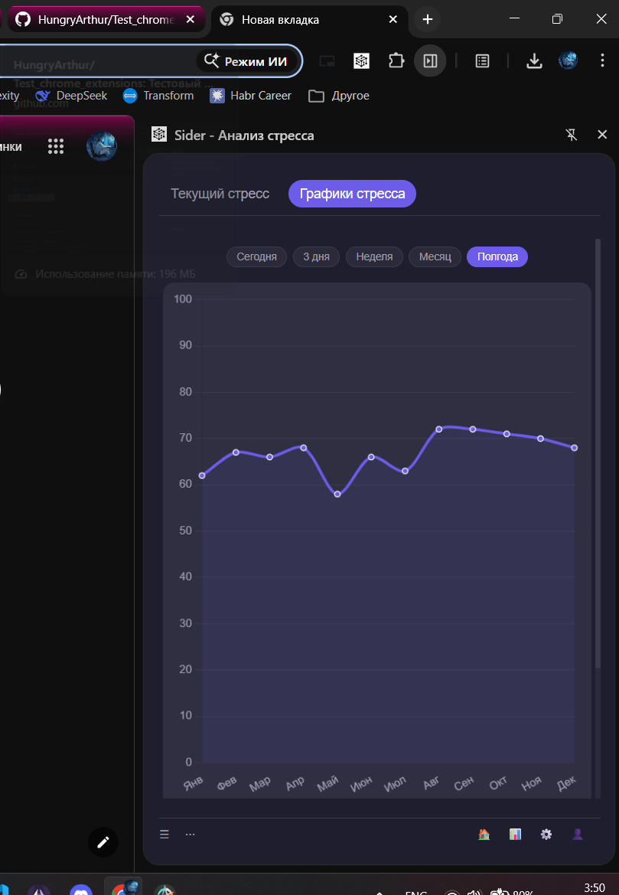

Общая архитектура (СЫРАЯ!!!)

stress-monitor-project/
├── extension/               # расширение
└── backend/                 # бэкенд

Документация API
https://developer.chrome.com/docs/extensions/reference/api/storage

## Вид отображения стресса в расширении:

## Вид отображения графика в расширении:

